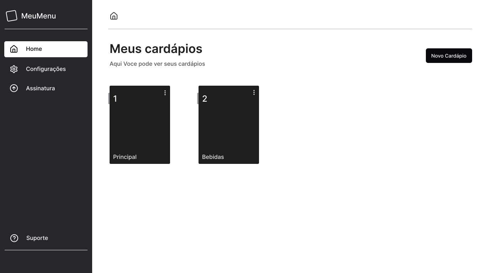

<div align="center" >
  </img>
</div>

## Meu menu

Meu menu é um SaaS feito em Next.js dedicado a criação, edição, visualização e gerenciamento de menus digitais. com uma interface simples e intuitiva, ele permite que usuários adicionem, editem, excluam e disponibilize itens de seus menu, oferecendo uma solução facil e eficiente para gerenciamento de cardápios.

## Principais recursos

- CRUD Completo: Realize operações de Criar, Ler, Atualizar e Deletar em menus e itens.
- Interface Responsiva: Projetado para funcionar perfeitamente em dispositivos móveis e desktops.
- Tecnologias Modernas: Desenvolvido utilizando Next.js, garantindo performance, escalabilidade e uma base sólida para o futuro.
- Personalização: Oferece flexibilidade para adaptar menus às necessidades do usuário.

## Tecnologias utilizadas

[](https://skillicons.dev)

## Página Home


## instalação


- clone o repositorio
  
``` bash 
  git clone https://github.com/jonassjr/MyMenuList.git
```

- instale dependências
``` bash
  npm install
```

- Configure as variáveis de ambiente no arquivo `.env` (exemplo incluído no repositório).

- Execute o projeto
``` bash
  npm run dev
```


## Estrutura do projeto

- `/app`: Diretório principal com páginas e rotas.
- `/app/(public)`: Contem páginas e rotas públicas.
- `/app/(users)`: Contem páginas e rotas privadas onde somente o usuarios logados.
- `/app/api`: Contém rotas da API implementadas com a pasta api do Next.js.
  - Rotas do NextAuth: Gerenciam a autenticação, como login, logout e callbacks.
  - Webhooks do Stripe: Processam eventos de pagamento e notificações vindas do Stripe, como confirmações de pagamento ou atualizações de assinatura.
- `/app/components`: Componentes reutilizáveis, como formulários e modais.
- `/schema`: Schemas de validação e tipagem (Zod).
- `/app/actions`: Abriga as funções assíncronas que realizam operações específicas no lado do servidor.
Essas ações incluem: Criação, edição e exclusão de menus e itens no banco de dados.
Operações relacionadas à autenticação, como criar um usuário após o login.
  - Em Next.js (com a estrutura do diretório app), as actions são uma alternativa para manter a lógica de servidor isolada, especialmente para Server Actions.
- `/app/lib`: Contém utilitários, configurações ou funções auxiliares reutilizáveis em diferentes partes do projeto, como por exemplos:
  integração com o Supabase para upload e gerenciamento de arquivos.
- `/app/services`: Contém funções ou classes que encapsulam a lógica para interagir com APIs externas ou serviços específicos, como:
  - prisma
  - NextAuth
  - Stripe
